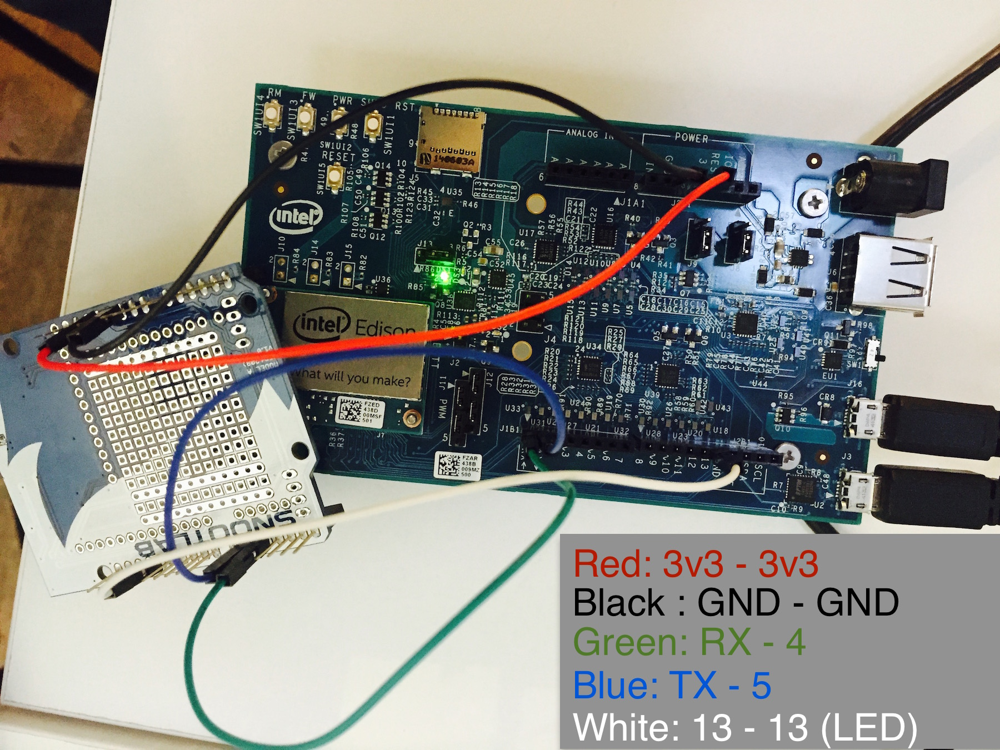

#SIGFOX & Intel Edison — Get Started

##Useful resources

* Get technical informations about  [SIGFOX](http://makers.sigfox.com)
* Get started with the [Intel Edison](https://communities.intel.com/community/makers/edison/getting-started)
* Check the spec of the [TD1208 module](https://github.com/Telecom-Design/Documentation_TD_RF_Module/blob/master/TD1208%20Reference%20Manual.pdf) used in this example


##Using nodeJS

###Prerequisites

* An Intel Edison
* A SIFOX board | shield
  * In this example, i'm using an [Akene shield from Snootlab](http://snoot.it/akene), with a TD1208 modules
* NodeJS
  * `opkg install nodejs`
  
###Set up

You need to communicate with your SIGFOX module over a serial connection.   
Meaning you need to wire your Edison's RX/TX to the correct pins of your shield.

The Akene i'm using for this example is using pins 4 & 5 to communicate with the module.  
So i need to set jumpers from RX to 4 & RX to 5.

Here's what it looks like : 



###Run your first command

_(On your Edison, over ssh, screen or whatever)_


```
$ npm install
$ node index.js
```

This will do two things : 

* Send the `AT&V` command, displaying useful infos about your module
* Send the current timestamp over SIGFOX, using the `AT$SF=` AT command


##Using the Arduino IDE

(WIP)


